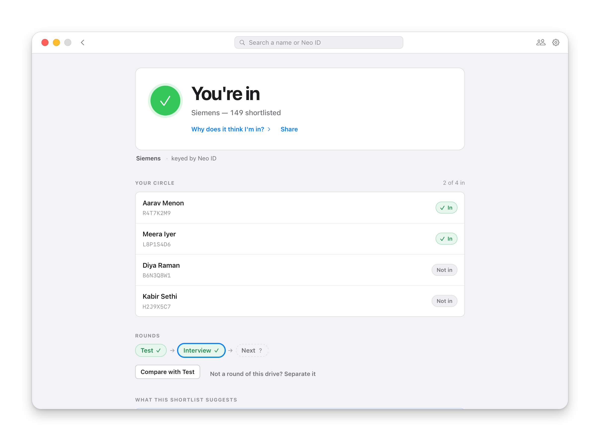
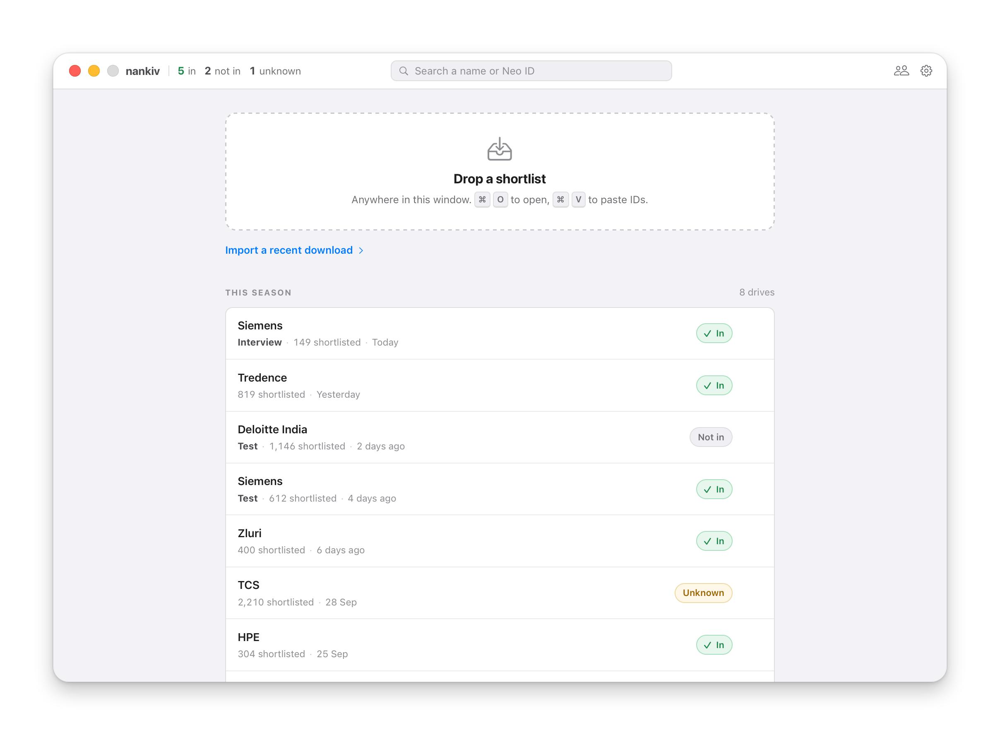
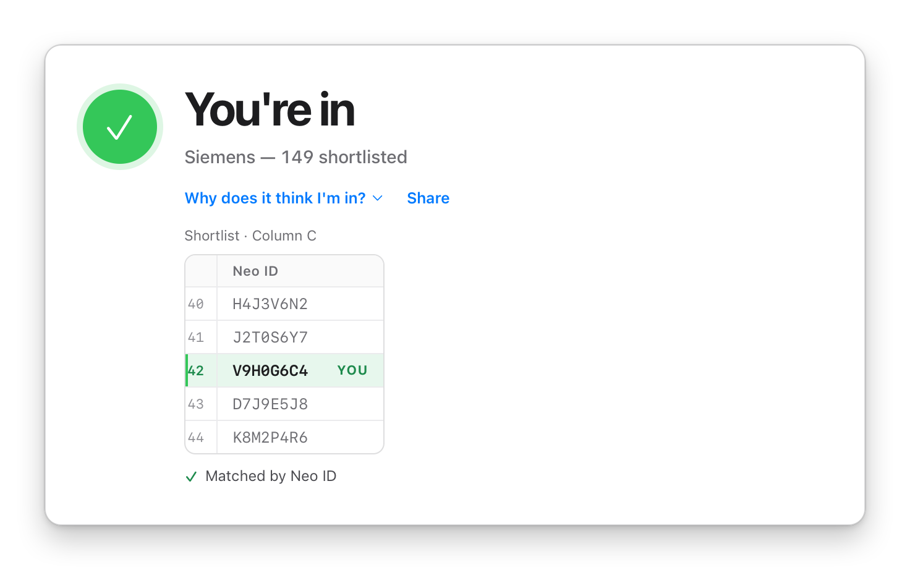
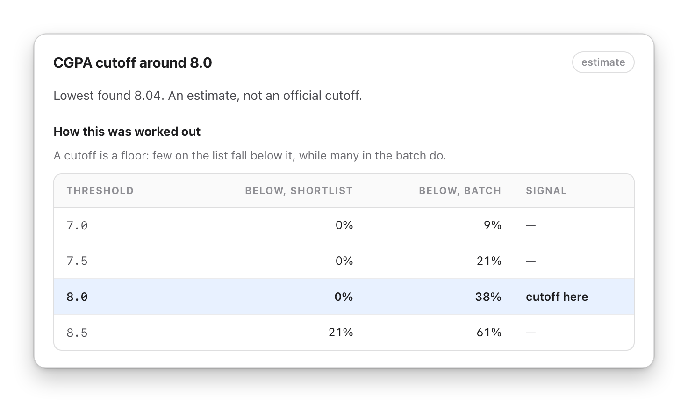
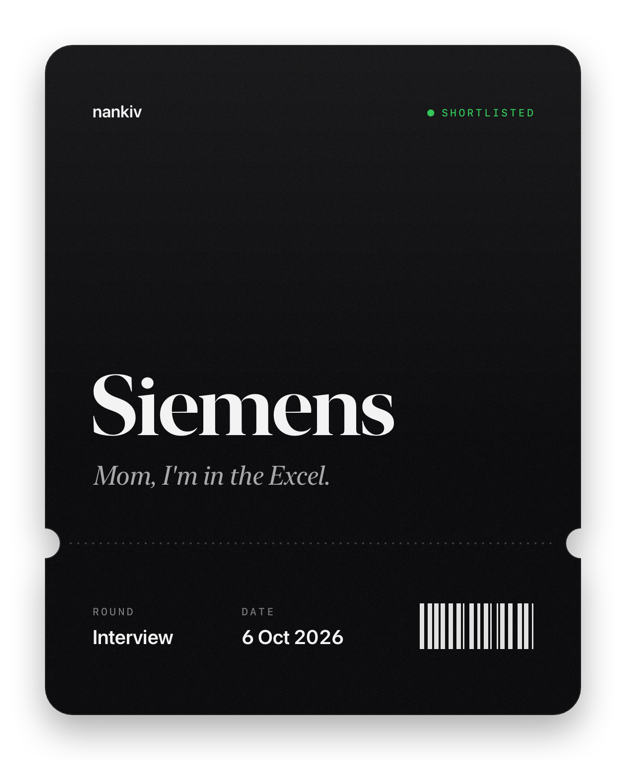
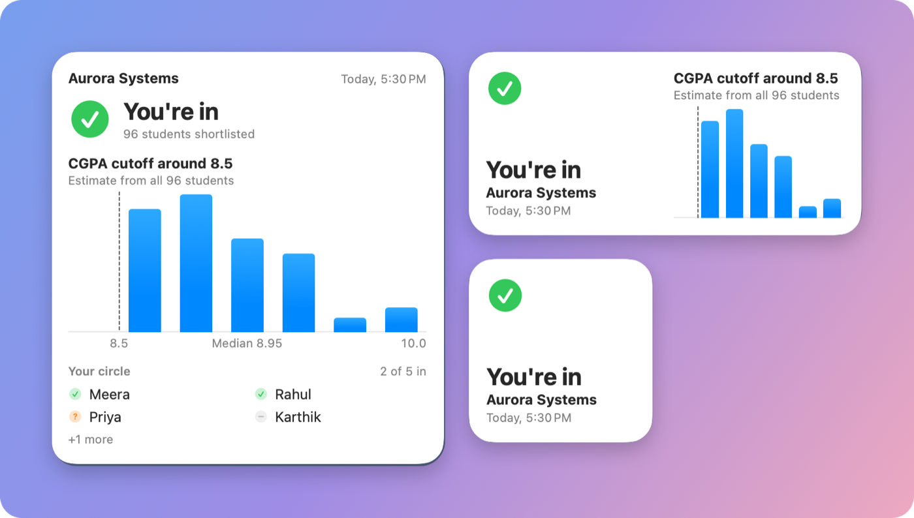

  <picture>
    <source media="(prefers-color-scheme: dark)" srcset="docs/images/icon-dark.png">
    
  </picture>

<h1 align="center">nankiv</h1>

  <b>Am I on the shortlist?</b> 
  Drop the file. Know in a second.

  <a href="https://github.com/JeyaViknan/nankiv/releases/latest/download/nankiv-macos-apple-silicon.dmg"><b>Download for Mac</b></a>
  &nbsp;&nbsp;·&nbsp;&nbsp;
  <a href="https://github.com/JeyaViknan/nankiv/releases/latest/download/nankiv-windows-setup.exe"><b>Download for Windows</b></a>
   
  Free&nbsp;&nbsp;·&nbsp;&nbsp;Works offline&nbsp;&nbsp;·&nbsp;&nbsp;No account&nbsp;&nbsp;·&nbsp;&nbsp;<a href="#download">Intel Mac and other files</a>

 

  <picture>
    <source media="(prefers-color-scheme: dark)" srcset="docs/images/hero-dark.png">
    
  </picture>

Placement season is a shortlist a day. Each one lands as a spreadsheet of
eight-character Neo IDs nobody remembers. So you open Excel, Ctrl+F yourself,
and message four friends to ask if they made it.

**nankiv does all of that the moment the file lands.** Your answer, your
friends' answers, and what the list says about how the company chose.

 

## Your answer, before Excel opens

Drop a shortlist anywhere on the window, or on nankiv's icon in the Dock. Paste
a list of IDs straight from an email. Or let nankiv check new shortlists in
your Downloads as they arrive.

You get one line: **You're in**, **Not this time**, or **Can't tell**, when a
file uses an ID it can't match you on. It never turns "can't tell" into a no.

## Your circle, in the same pass

Add your friends once, by name or Neo ID. Every shortlist after that answers
for them too, right under your own result. When a company runs rounds, nankiv
links them, so you can see who moved from the test to the interview.

 

<h3 align="center">Your whole season, at a glance</h3>

Every shortlist you've had, with your answer on its row.

  <picture>
    <source media="(prefers-color-scheme: dark)" srcset="docs/images/season-dark.png">
    
  </picture>

 

<h3 align="center">Don't take its word for it</h3>

  Ask why, and nankiv shows you the file at your row: the column as it was
  headed, the rows on either side, yours lit. A wrong match is worse than none,
  so when two people could be you, it refuses to guess.

  <picture>
    <source media="(prefers-color-scheme: dark)" srcset="docs/images/proof-dark.png">
    
  </picture>

 

<h3 align="center">What it took</h3>

  nankiv compares the list with your batch. It tells you when a CGPA cutoff is
  likely and roughly where it sits, which branches the list leaned towards, and
  where you stand. Always labelled an estimate. Never passed off as official.

  <picture>
    <source media="(prefers-color-scheme: dark)" srcset="docs/images/cutoff-dark.png">
    
  </picture>

 

<h3 align="center">Made it? Say so.</h3>

  Turn a yes into a card worth posting, with a line for the occasion. It
  carries the company, the round and the day, and never your Neo ID, your CGPA
  or how many made the list. Or copy a summary set for the group chat.

  

 

<h3 align="center">On your desktop</h3>

  Your latest result as a widget, in four sizes on macOS. Click it and nankiv
  opens that shortlist.

  

 

## Private by design

- **Everything stays on your computer.** No account, no server, no telemetry.
  nankiv only goes online when you ask it to check for updates.
- **The only CGPA it shows is yours.** It knows your batch's academic data, so
  the analysis works from your first file, but uses it only for aggregates. No
  screen shows anyone else's figure, not even your friends'.
- **It reads what it needs and nothing more.** Phone numbers, emails, dates of
  birth and resume links in a sheet are never read, and there is nowhere in
  nankiv to keep them.
- **One click forgets everything,** with a list of exactly what's stored.

The full reasoning is in [docs/PRIVACY.md](docs/PRIVACY.md). If you're setting
nankiv up for your batch, tell your placement cell first: it's their data, and
your classmates'.

## Download

| Your machine | File |
| --- | --- |
| **Mac** with Apple Silicon (M1 or later) | [nankiv-macos-apple-silicon.dmg](https://github.com/JeyaViknan/nankiv/releases/latest/download/nankiv-macos-apple-silicon.dmg) |
| **Mac** with an Intel processor | [nankiv-macos-intel.dmg](https://github.com/JeyaViknan/nankiv/releases/latest/download/nankiv-macos-intel.dmg) |
| **Windows** 10 or 11 | [nankiv-windows-setup.exe](https://github.com/JeyaViknan/nankiv/releases/latest/download/nankiv-windows-setup.exe) |
| **Windows**, for IT deployment | [nankiv-windows.msi](https://github.com/JeyaViknan/nankiv/releases/latest/download/nankiv-windows.msi) |

Not sure which Mac you have? Apple menu → *About This Mac*.

**First launch.** nankiv isn't code signed yet, so your computer warns you the
first time. On a Mac, open nankiv once and close the warning, then go to *System
Settings → Privacy & Security* and click *Open Anyway* (on macOS 14 or earlier,
right-click the app and choose *Open*). On Windows, click *More info*, then *Run
anyway*. You only do this once.

**Getting started.** Tell nankiv your Neo ID, and your registration number,
since some companies list students by that instead. Then drop your first
shortlist. To add the widget on a Mac, right-click the desktop, choose *Edit
Widgets* and search for nankiv.

Every version is on the [releases page](https://github.com/JeyaViknan/nankiv/releases).

 

---

  
    Built with Rust, Tauri and React, and native SwiftUI for the widget.
    <a href="docs/DEVELOPMENT.md">Build it yourself</a>&nbsp;·&nbsp;<a href="docs/PRIVACY.md">Privacy</a>&nbsp;·&nbsp;MIT licence
     
    The screenshots show an invented season. Nobody in them is real.
  

